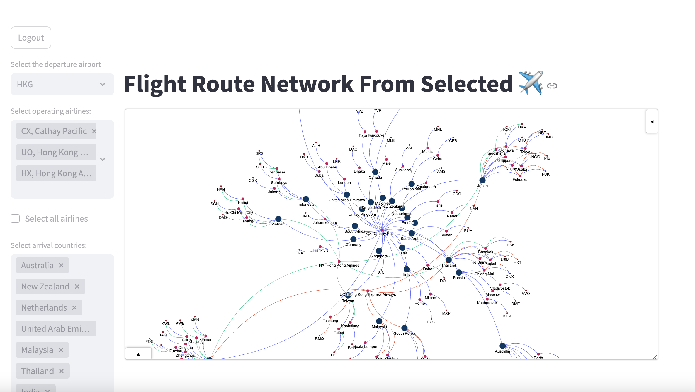

# airport-network-graph-demo
This is a demo project with a simple streamlit dashboard for visualising flight route network in a graph

Here the data used are open-source flight routes data which are obtained from data.world (provided by Tyler Woebkenberg), 
https://data.world/tylerudite/airports-airlines-and-routes

## A) Flight Route Data

The data contains the (commercial passenger) flight routes data including available flight routes and corresponding airlines, 
airports.

## B) How to run

After installing the required packages, run the following command in terminal

``
streamlit run dashboard_example/app.py
``

## C) Screenshot examples

An example of local airlines (i.e. CX, UO, HX) available flight route network departing from Hong Kong International Airport (HKG)

screenshot video demo

